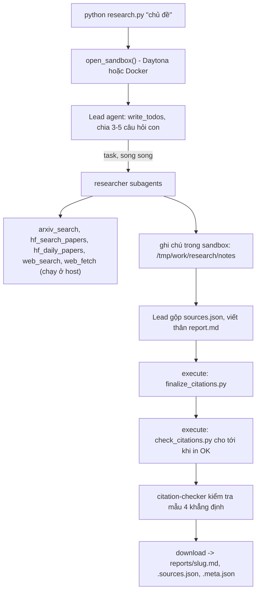

# Deep Research Agent (Deep Agents + Sandbox)

Bài nộp lab Day 23. Hệ thống nhận một chủ đề (ví dụ `survey about world model`), tự lập kế hoạch, giao việc cho nhiều subagent tìm tài liệu trên arXiv, Hugging Face và web, rồi viết một **báo cáo có trích dẫn kiểm chứng được**. Báo cáo của 5 chủ đề trong [`topics.md`](topics.md) nằm ở [`reports/`](reports/).

Đề bài gốc: [`GUIDE.md`](GUIDE.md), thang điểm: [`RUBRIC.md`](RUBRIC.md), mẫu báo cáo: [`REPORT_TEMPLATE.md`](REPORT_TEMPLATE.md).

## 1. Cài đặt

Cần Python 3.11 trở lên.

```bash
# Linux / macOS
python3 -m venv .venv && source .venv/bin/activate
pip install -r requirements.txt
cp .env.example .env
```

```powershell
# Windows PowerShell
python -m venv .venv; .\.venv\Scripts\Activate.ps1
pip install -r requirements.txt
Copy-Item .env.example .env
```

Điền khóa của bạn vào `.env` (tệp này nằm trong `.gitignore`, không bao giờ commit):

| Biến | Dùng để | Lấy ở đâu |
|---|---|---|
| `LAB_MODEL` + khóa nhà cung cấp | Mô hình LLM, **phải hỗ trợ tool calling**. Ví dụ `LAB_MODEL=openai:<tên mô hình>` và `OPENAI_API_KEY`. | Nhà cung cấp bạn chọn; các cách cấu hình khác xem [`.env.example`](.env.example) |
| `DAYTONA_API_KEY` | Sandbox Daytona | https://app.daytona.io (không có tài khoản: đặt `SANDBOX=docker`) |
| `EXA_API_KEY` | Tìm kiếm và đọc trang web qua Exa MCP | https://dashboard.exa.ai/api-keys |

Một chủ đề cần hơn một trăm lần gọi mô hình, nên gói miễn phí giới hạn vài chục yêu cầu mỗi ngày là không đủ.

## 2. Chạy

```bash
python tools.py                                  # thử riêng 5 công cụ nguồn dữ liệu, không cần LLM
python research.py "survey about world model"    # chạy một chủ đề, khoảng 4-6 phút
python self_check.py                             # kiểm tra reports/ trước khi nộp, không tốn token
```

`research.py` in `saved reports/<slug>.md` và thoát mã 0 khi thành công. Khi thất bại (LLM lỗi, không tạo được sandbox, agent không viết ra báo cáo) nó in `FAILED: ...`, thoát mã 1 và **không ghi tệp nào**. Không có chủ đề thì thoát mã 2.

## 3. Đọc `reports/`

Mỗi chủ đề sinh ra ba tệp cùng tên `<slug>`:

| Tệp | Nội dung |
|---|---|
| `<slug>.md` | Báo cáo: TL;DR, Background, các phần theo chủ đề, Trends and open problems, References. Mỗi khẳng định mang trích dẫn `[n]`. |
| `<slug>.sources.json` | Danh sách nguồn `{n, id, url, title, date, source}`. Số `n` khớp với `[n]` trong báo cáo và với dòng `[n]` trong `## References`. |
| `<slug>.meta.json` | Bằng chứng về lần chạy: mô hình, thời gian, số lần gọi công cụ, token, số nguồn, các họ nguồn. |

Để lần theo một trích dẫn: lấy số `[n]` trong báo cáo, tìm dòng `[n]` ở cuối tệp (hoặc mục có cùng `n` trong `sources.json`) và mở `url`.

Trường `source` cho biết **công cụ đã trả về nguồn đó**, không phải tên miền: `arxiv` (`arxiv_search`), `hf-search` (`hf_search_papers`), `hf-daily` (`hf_daily_papers`), `web` (`web_search` / `web_fetch`). Một bài arXiv tìm thấy qua tìm kiếm web vì thế có `source` là `web`.

Các trường của `meta.json`:

- `subagent_calls`: số lần lead gọi công cụ `task` để giao việc cho subagent.
- `tool_calls`: số lần lead gọi từng công cụ.
- `tokens`: token của **riêng lead**. Token của subagent không nằm trong đó, nên chi phí thật cao hơn.
- `n_sources`, `source_families`: số nguồn và các giá trị `source` khác nhau trong `sources.json`.

Kiểm tra trích dẫn của một báo cáo (in `OK: N sources, all citations resolve` khi hợp lệ):

```bash
python check_citations.py reports/<slug>.md reports/<slug>.sources.json
```

## 4. Kết quả đã nộp

Cả 5 báo cáo được sinh bằng `openai:gpt-6-luna` với sandbox Daytona; `python self_check.py` báo `READY to submit`.

| Chủ đề | Báo cáo | `subagent_calls` | Nguồn | Họ nguồn | Thời gian |
|---|---|---|---|---|---|
| survey about world model | [md](reports/survey-about-world-model.md) | 5 | 25 | hf-daily, hf-search, web | 332 s |
| survey about reinforcement learning for LLM reasoning | [md](reports/survey-about-reinforcement-learning-for-llm-reasoning.md) | 5 | 22 | hf-daily, hf-search, web | 351 s |
| survey about LLM agents and tool use | [md](reports/survey-about-llm-agents-and-tool-use.md) | 5 | 23 | hf-daily, hf-search, web | 349 s |
| survey about video and multimodal generation | [md](reports/survey-about-video-and-multimodal-generation.md) | 5 | 22 | hf-daily, hf-search, web | 311 s |
| survey about efficient inference and small language models | [md](reports/survey-about-efficient-inference-and-small-language-models.md) | 5 | 21 | hf-daily, hf-search, web | 237 s |

Các báo cáo là bản tải về nguyên vẹn từ sandbox, không sửa tay.

## 5. Hệ thống hoạt động thế nào



| Tệp | Vai trò |
|---|---|
| [`research.py`](research.py) | Script chính: mở sandbox, tải hai script kiểm tra lên, chạy lead agent, tải báo cáo về, ghi `meta.json`. |
| [`agents.py`](agents.py) | Prompt của lead, `researcher` và `citation-checker`; cấu hình subagent và giới hạn số lần gọi. |
| [`tools.py`](tools.py) | `with_retry` và 5 công cụ nguồn dữ liệu. |
| [`check_citations.py`](check_citations.py) | Bộ kiểm tra trích dẫn, chạy trong sandbox (chỉ dùng thư viện chuẩn). |
| `model.py`, `sandbox.py`, `finalize_citations.py`, `self_check.py` | Có sẵn từ đề bài, không sửa. |

Một số quyết định thiết kế:

- **Bí mật ở lại host.** Mọi công cụ gọi mạng chạy ở host; sandbox chỉ chứa ghi chú, báo cáo và hai script kiểm tra. `EXA_API_KEY` đi trong URL của endpoint nên được che khỏi mọi chuỗi `ERROR: ...` trả về cho agent.
- **Nội dung lấy về là dữ liệu không đáng tin.** Cả ba prompt đều yêu cầu không làm theo chỉ dẫn nằm trong kết quả công cụ, và chỉ ghi những gì có trong văn bản đã lấy.
- **Công cụ không bao giờ ném ngoại lệ.** Chúng trả `NO RESULTS` hoặc `ERROR: ...` sau khi đã retry (backoff lũy thừa có jitter, tôn trọng `Retry-After`), để agent đổi nguồn thay vì dừng.
- **Trích dẫn đúng nhờ mã, không nhờ prompt.** Lead chỉ viết thân báo cáo; `finalize_citations.py` đánh số lại và sinh `## References`, sau đó `check_citations.py` phải in `OK`.
- **Có giới hạn vòng lặp.** `recursion_limit=1000` cho lead; số lần gọi mô hình / công cụ tối đa là 150 / 300 cho lead, 40 / 60 cho mỗi researcher và 20 / 30 cho citation-checker.

## 6. Hạn chế đã biết

- **Không báo cáo nào có nguồn họ `arxiv`.** Khi thử `python tools.py`, `arxiv_search` trả kết quả ở lần gọi đầu rồi bị `HTTP 429` và timeout ở các lần sau; nhiều khả năng điều này lặp lại trong các lần chạy. Bài báo arXiv vẫn xuất hiện, nhưng qua Hugging Face và tìm kiếm web.
- **Kết quả có tính ngẫu nhiên.** Chạy lại cùng một chủ đề sẽ cho nguồn và câu chữ khác; số nguồn `hf-daily` phụ thuộc vào những bài đang có trên Daily Papers hôm đó.
- **`citation-checker` chỉ kiểm tra mẫu** 4 khẳng định mỗi báo cáo, nên không bảo đảm mọi câu đều khớp với nguồn.
